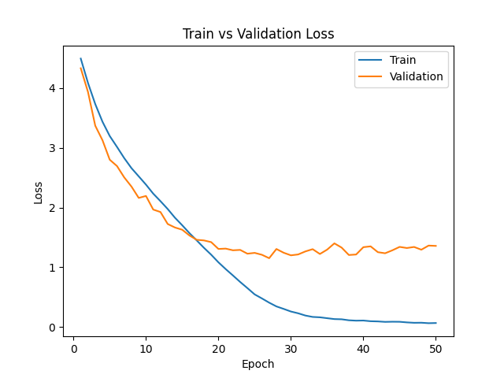
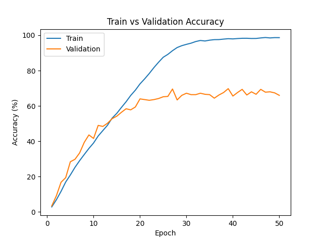

# 📊 Training Results

This readme contains the training metrics and performance visualizations for the model in this directory.

---

## 🔹 F1 Score

- Training F1 Score: Approaches ~0.98–1.0, nearly perfect on the training set.
- Validation F1 Score: Plateaus around ~0.63–0.67

---

## 🔹 Loss Curve

- Training Loss: Drops aggressively to near 0 by epoch 40–50.
- Validation Loss: Flattens around ~1.2–1.4 after epoch 15 and shows a slight upward trend, confirming stronger overfitting.

---

## 🔹 Accuracy

- Training Accuracy: Reaches ~98–100% by epoch 50, climbing rapidly after epoch 15.
- Validation Accuracy: Plateaus around ~63–67%, with fluctuations and a widening gap from training accuracy.

---

## 📁 Files Included

- `f1_score.png` – F1 score vs epochs  
- `loss.png` – Training & validation loss vs epochs  
- `accuracy.png` – Training & validation accuracy vs epochs  

---

## Observation

Clearly, the model is *highly* overfit
