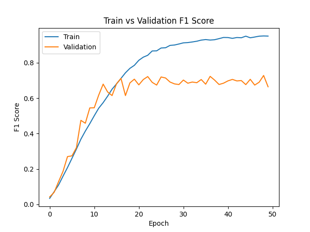
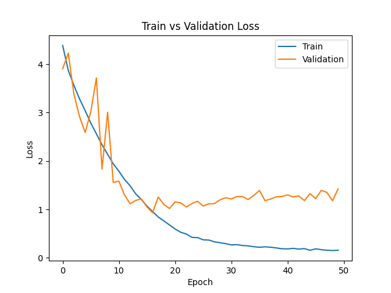
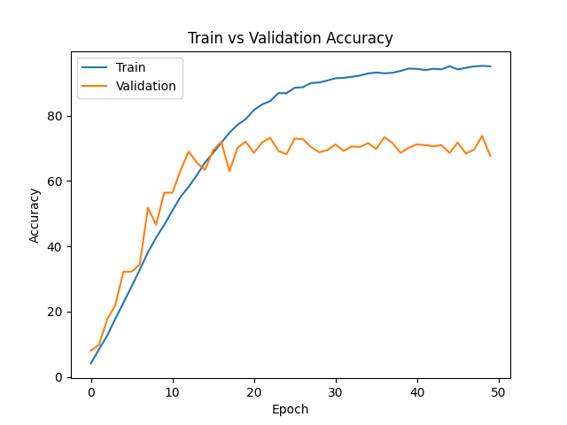

# 📊 Training Results

This repository contains the training metrics and performance visualizations for the model.

---

## 🔹 F1 Score

The F1 Score measures the balance between precision and recall across classes.

---

## 🔹 Loss Curve

The loss curve shows how the training and validation loss evolved over epochs.

---

## 🔹 Accuracy

Accuracy represents the percentage of correct predictions over time.

---

## 📁 Files Included

- `f1_score.png` – F1 score vs epochs  
- `loss.png` – Training & validation loss vs epochs  
- `accuracy.png` – Training & validation accuracy vs epochs  

---

## 🚀 Usage

Ensure all three `.png` files are located in the root directory of the repository (or update the image paths accordingly).

GitHub will automatically render these images inside this README.
