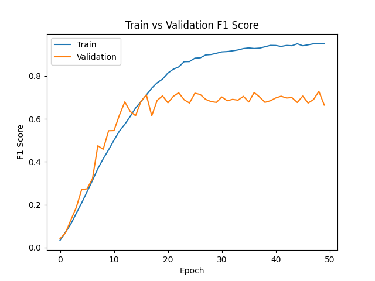
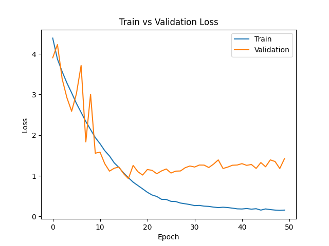
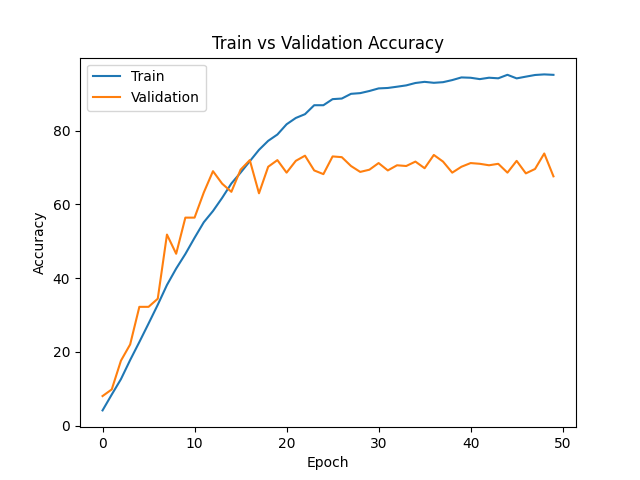

# 📊 Training Results

This readme contains the training metrics and performance visualizations for the model in this directory.

---

## 🔹 F1 Score

- Training F1 Score: Climbs to ~0.92, following a similar trajectory to accuracy.
- Validation F1 Score: Peaks around ~0.72 near epoch 13–15, then gradually settles to ~0.68–0.71 with oscillations.

---

## 🔹 Loss Curve

- Training Loss: Decreases steadily to ~0.15 by epoch 50.
- Validation Loss: Drops initially to ~1.0 by epoch 15 but then slightly increases and stabilizes around ~1.1–1.4, indicating early signs of overfitting.

---

## 🔹 Accuracy

- Training Accuracy: Reaches ~92% by epoch 50, with a smooth and steady climb after epoch 15.
- Validation Accuracy: Plateaus around ~68–72%, with noticeable fluctuations throughout training.

---

## 🔹 Test Scores

- Test acc: 69.40
- Test F1: 0.6807

## 📁 Files Included

- `f1_score.png` – F1 score vs epochs  
- `loss.png` – Training & validation loss vs epochs  
- `accuracy.png` – Training & validation accuracy vs epochs  

---

## Observation

After adding dropouts near the end of the ResNet model layers, overfitting is reduced minimally but the model generalisability was also affected slightly.
