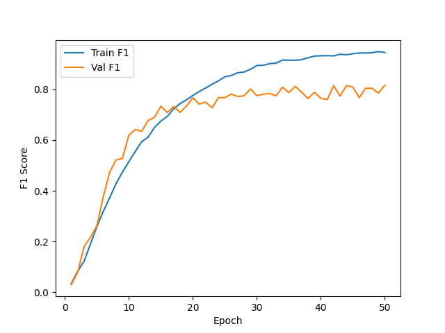
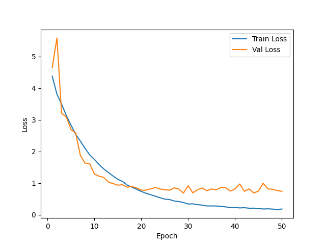
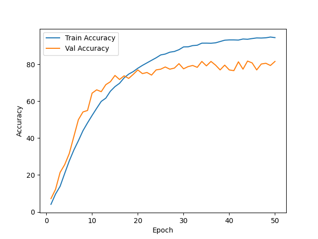

# 📊 Training Results
This readme contains the training metrics and performance visualizations for the ResNet-101 sports image classification model in this directory.

---

## 🔹 F1 Score
- Training F1 Score: Climbs steadily to ~0.94 by epoch 50, mirroring the accuracy curve closely.
- Validation F1 Score: Rises to ~0.75 by epoch 20, then plateaus in the ~0.76–0.81 range with noticeable epoch-to-epoch oscillations through epoch 50.

---

## 🔹 Loss Curve
- Training Loss: Decreases smoothly from ~4.4 to ~0.18 by epoch 50, with no signs of stalling.
- Validation Loss: Spikes to ~5.6 around epoch 2–3, then drops sharply to ~0.8 by epoch 20 before flattening in the ~0.7–0.95 range with mild oscillations, indicating moderate overfitting after epoch 20.

---

## 🔹 Accuracy
- Training Accuracy: Reaches ~94% by epoch 50, with a steady climb after epoch 15.
- Validation Accuracy: Plateaus around ~78–82%, with consistent fluctuations from epoch 25 onwards.

---

## 🔹 Test Scores

- Test acc: 81.60
- Test F1: 0.8109

---

## 📁 Files Included
- `f1_score.png` – F1 score vs epochs
- `loss.png` – Training & validation loss vs epochs
- `accuracy.png` – Training & validation accuracy vs epochs
- `notebookd6338ee69d.py` – Training script (custom ResNet-101 implementation)

---

## 🔹 Model & Setup
- Architecture: Custom ResNet-101 built from scratch (bottleneck block with [3, 4, 23, 3] layer config), 100-class output, dropout (p=0.5) before the final FC layer.
- Dataset: Sports image classification (100 classes), filtered to `.jpg`/`.jpeg` files only.
- Augmentations: `RandomHorizontalFlip` (p=0.5) + `ColorJitter` (brightness/contrast/saturation 0.2, hue 0.05) applied with p=0.5.
- Optimizer: Adam, `lr=1e-4`, `weight_decay=1e-4`.
- Loss: Cross-Entropy.
- Batch size: 8, Epochs: 50.

---

## Observation
The model converges well on the training set but the train/val gap widens after epoch ~20 — train accuracy continues rising past 90% while validation stalls near 80%, and validation loss flattens while training loss keeps falling. The single dropout layer before the FC head curbs overfitting only mildly. Removing the dropout inside bottleneck ResNet blocks might have played a role. However, augmentation clearly helped reduce overfitting without affecting generalizability.
