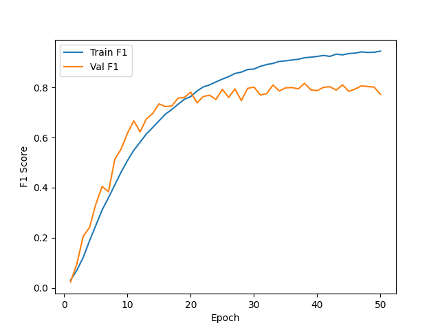
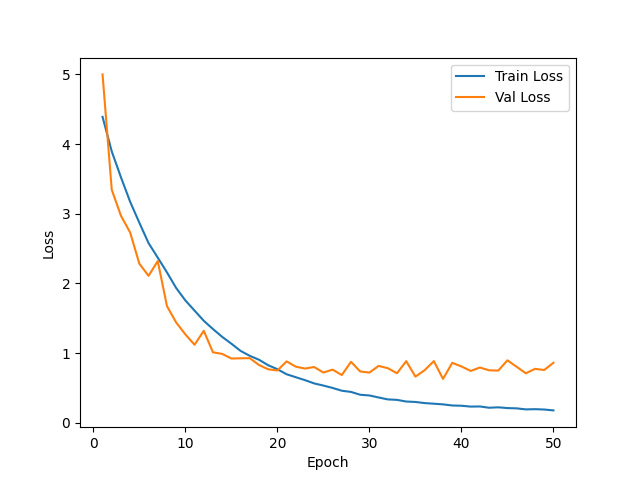
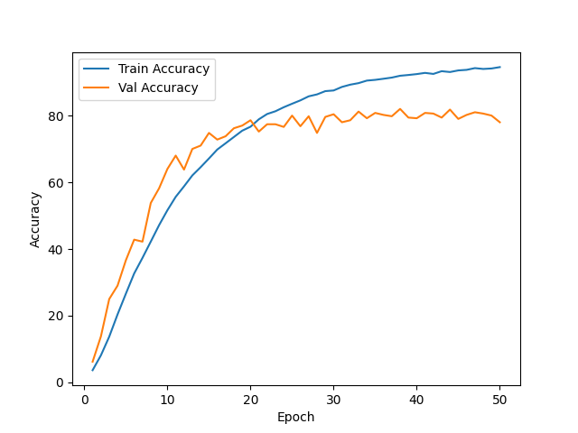

# 📊 Training Results
This readme contains the training metrics and performance visualizations for the ResNet-101 sports image classification model in this directory.
---
## 🔹 F1 Score
- Training F1 Score: Climbs steadily from ~0.03 to ~0.94 by epoch 50, mirroring the accuracy curve closely.
- Validation F1 Score: Rises quickly to ~0.76 by epoch 18, crosses above the training curve early on, then plateaus in the ~0.77–0.81 range with epoch-to-epoch oscillations through epoch 50.

---
## 🔹 Loss Curve
- Training Loss: Decreases smoothly from ~4.4 to ~0.18 by epoch 50, with no signs of stalling.
- Validation Loss: Starts higher than training (~5.0 at epoch 1), drops faster than training through epoch 13 (~1.0), then flattens in the ~0.65–0.90 range with mild oscillations while training loss continues falling — indicating moderate overfitting after epoch ~20.

---
## 🔹 Accuracy
- Training Accuracy: Reaches ~94.5% by epoch 50, with a steady climb after epoch 10.
- Validation Accuracy: Rises rapidly through epoch 20 (~78%), peaks at 82.0% at epoch 38, then plateaus in the ~78–82% range with consistent fluctuations.

---
## 🔹 Test Scores
- Test acc: 78.40%
- Test F1: 0.7787
---
## 📁 Files Included
- `f1_score.png` – F1 score vs epochs
- `loss.png` – Training & validation loss vs epochs
- `accuracy.png` – Training & validation accuracy vs epochs
- `notebook<hash>.py` – Training script (custom ResNet-101 implementation)
---
## 🔹 Model & Setup
- Architecture: Custom ResNet-101 built from scratch (bottleneck block with [3, 4, 23, 3] layer config), 100-class output, dropout (p=0.5) before the final FC layer.
- Dataset: Sports image classification (100 classes), filtered to `.jpg`/`.jpeg` files only.
- Augmentations: `RandomHorizontalFlip` (p=0.5) + `ColorJitter` (brightness/contrast/saturation 0.2, hue 0.05) applied with p=0.5. Inputs normalized with ImageNet channel statistics (mean=[0.485, 0.456, 0.406], std=[0.229, 0.224, 0.225]).
- Optimizer: Adam, `lr=1e-4`, `weight_decay=1e-4`.
- Loss: Cross-Entropy.
- Batch size: 8, Epochs: 50.
---
## Observation
Adding ImageNet-statistics input normalization on top of the augmentation pipeline did not improve final test performance compared to the augmentation-only run (78.40% vs. 82.00% accuracy, 0.7787 vs. 0.8122 F1). One notable difference in the dynamics: validation metrics lead training metrics through roughly the first 18 epochs — visible in all three curves — which is unusual and reflects the regularization from dropout and augmentation being applied only during training. The model peaks at 82.0% val accuracy around epoch 38 but the final-epoch checkpoint at 78.0% is what was tested, suggesting that saving the best-val checkpoint rather than the last one would have recovered ~3–4 points of test accuracy. The result is consistent with the theoretical expectation that for from-scratch training, ImageNet channel statistics are not a meaningful improvement over no normalization — the first conv layer absorbs any input scale offset during training. The overfitting pattern (train climbs into the 90s, val plateaus in the high 70s/low 80s) matches the augmentation-only run, suggesting normalization affected absolute scores within run-to-run noise but not the overall train/val gap dynamics.
