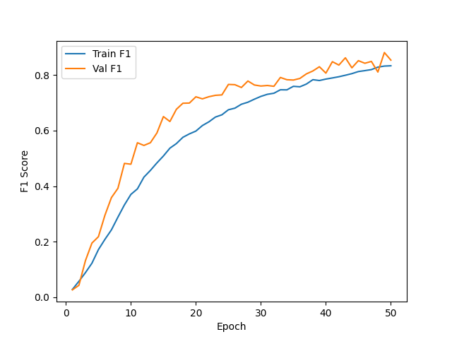
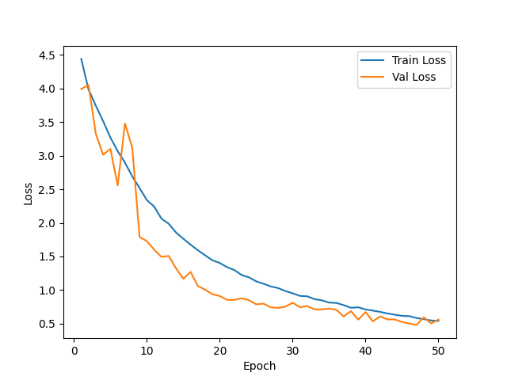
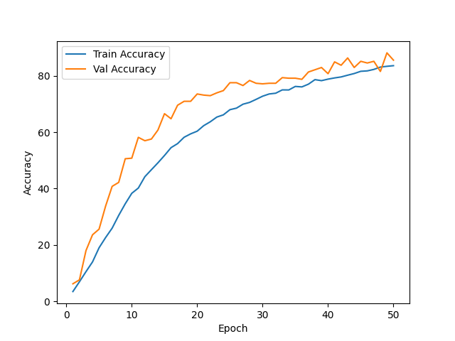

# 📊 Training Results — Strong Augmentation
This readme contains the training metrics and performance visualizations for the ResNet-101 sports image classification model trained with a stronger augmentation pipeline.
---
## 🔹 F1 Score
- Training F1 Score: Climbs steadily to ~0.83 by epoch 50, tracking the training accuracy curve closely.
- Validation F1 Score: Rises sharply to ~0.72 by epoch 20, then continues climbing more gradually to ~0.85 by epoch 50, with mild epoch-to-epoch oscillations. Notably, validation F1 stays *above* training F1 throughout most of the run.

---
## 🔹 Loss Curve
- Training Loss: Decreases smoothly from ~4.44 to ~0.54 by epoch 50, with no signs of stalling.
- Validation Loss: Drops from ~3.99 to ~0.56 over the run, staying consistently *below* training loss after epoch 9. Mild oscillations in the ~0.5–0.8 range from epoch 25 onwards but no upward drift, indicating no overfitting.

---
## 🔹 Accuracy
- Training Accuracy: Reaches ~83.65% by epoch 50, with a steady climb after epoch 15.
- Validation Accuracy: Climbs to ~85.6% by epoch 50, peaking at 88.20% on epoch 49. Validation accuracy stays consistently above training accuracy from around epoch 7 onwards.

---
## 🔹 Test Scores
- Test acc: 85.80%
- Test F1: 0.8480
---
## 📁 Files Included
- `f1_score.png` – F1 score vs epochs
- `loss.png` – Training & validation loss vs epochs
- `accuracy.png` – Training & validation accuracy vs epochs
- `notebookd6338ee69d.py` – Training script (custom ResNet-101 implementation)
---
## 🔹 Model & Setup
- Architecture: Custom ResNet-101 built from scratch (bottleneck block with [3, 4, 23, 3] layer config), 100-class output, dropout (p=0.5) before the final FC layer.
- Dataset: Sports image classification (100 classes), filtered to `.jpg`/`.jpeg` files only.
- Augmentations: `RandomResizedCrop(224, scale=(0.7, 1.0))` + `RandomHorizontalFlip` (p=0.5) + `ColorJitter` (brightness/contrast/saturation 0.3, hue 0.1) applied with p=0.5 + `RandomRotation(15)` + ImageNet normalization (mean=[0.485, 0.456, 0.406], std=[0.229, 0.224, 0.225]) + `RandomErasing` (p=0.25, scale=(0.02, 0.2)).
- Optimizer: Adam, `lr=1e-4`, `weight_decay=1e-4`.
- Loss: Cross-Entropy.
- Batch size: 8, Epochs: 50.
---
## Observation
With the stronger augmentation pipeline, the overfitting pattern from the previous run is reversed — validation metrics consistently outperform training metrics throughout the run. Validation accuracy ends at 85.6% (peaking at 88.2% on epoch 49) while training accuracy reaches only 83.6%, and validation loss tracks below training loss for most epochs. This is a healthy sign that the augmentations (`RandomResizedCrop`, stronger `ColorJitter`, `RandomRotation`, `RandomErasing`) are making the training task substantially harder than evaluation, forcing the model to learn more robust, generalizable features. The training curves are still trending downward at epoch 50, suggesting the model has not yet fully converged and additional epochs would likely yield further gains. Compared to the basic-augmentation run, validation F1 improved from ~0.81 to ~0.85 and validation accuracy from ~80% to ~85.6%, demonstrating that the additional augmentations directly translated to better generalization without sacrificing training stability.
